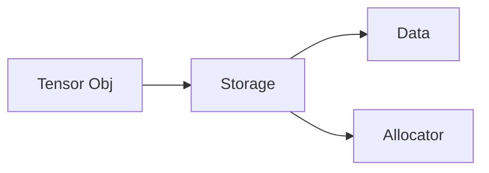

import imageNoelThomas from '@/images/team/noel-thomas.jpg'
import imageLaptop from '@/images/laptop.jpg'

export const article = {
  date: '2025-05-29',
  title: 'Pytorch Internals [WIP]',
  description:
    'What exactly Pytorch does behind the scenes to enable performant tensor computations.',
  author: {
    name: 'Noel Thomas',
    role: 'Founder',
    image: { src: imageNoelThomas },
    color: '#2563eb',
  },
  image: { src: imageLaptop },
  tags: ['pytorch', 'deep learning'],
}

export const metadata = {
  title: article.title,
  description: article.description,
  alternates: { canonical: '/blog/Pytorch-Internals' },
}

> Based on *PyTorch 2 Internals* by Christian Perone (December 2023) - https://blog.christianperone.com/2023/12/pytorch-2-internals-talk/ and ezyang&apos;s blog on Pytorch internals

> Read more of this if you are interested in finding out how to contribute to PyTorch

Have you ever rolled up your sleeves and decided to finally crack machine learning? Like *really* understand it? How do we go from adding scalar values to training models? What does it even mean to train a model?

These are the questions that led me to my first project on automatic differentiation. At the time my peers also had piqued my interest in Rust, so the project ended up being a [messy .rs file](https://github.com/GroupLabs/autodiff/blob/main/src/main.rs) (< 300 LOC) that:

1. defined a node class that supported certain primitive operations
2. automatically generated a computation graph as a directed acyclical graph (not on enforced, but as a property of the generation mechanism), and
3. implemented a backprop mechanism that forced me to relearn some derivative rules.

The idea was to eventually extend this to support operations on tensors, and add more operations. To figure out how to do this, I decided to look into the PyTorch implementation. Safe to say, it wasn&apos;t going to be simple (as one would imagined).

PyTorch is a tensor library that is especially useful for training deep learning models. To be clear, PyTorch was not the first of its kind. You might come across names like Theano, Caffe, TensorFlow, Keras, and so forth. There are also more modern products like JAX, and MLX; each offer unique advantages that are worth considering at the beginning of a project. However, it is also worth noting that most model implementations today end up in either PyTorch or JAX.

Before we discuss the advantages of each, let&apos;s get an idea of how PyTorch works. This can be the baseline to which we compare other frameworks and how they implement their features.

---

## Tensors

> **NOTE**: Aten is the foundational tensor library (which is written in C++14) on which the PyTorch tensor implementation is written on top of . This is a pattern you will notice in many high-performance computing libraries (eg. numpy, Triton, SciPy, and so forth).

The simplest building block in PyTorch is the tensor. It can be thought of as a n-dimensional matrix. A tensor will:
1. only have a single data type,
2. have a shape,
3. reside in a single device.

The Tensor class is not actually responsible for holding the data. There&apos;s another abstraction called Storage. This holds a pointer to the raw data, and contains information like the size, and allocator. However, it doesn&apos;t tell us how to interpret the data. This allows us to decouple the data and how it&apos;s interpreted. These interpretations are known as views.

The Allocator is a mechanism that allows us to move data between different devices, like the CPU and GPU. Under the hood, the Allocator will use `cudaMalloc()` and `posix_memalign()` for GPUs and CPUs respectively.



Tensors also contain metadata about the mathematical tensor it represents. This includes the sizes, layout, data type, and stride. Further information is carried by the Tensor for automatic differentiation. While many of these are self-explanatory, the stride is somewhat obscure. When dealing with computer systems, we also have to consider the physical implementation of mathematical concepts. A simple way to think about memory is like a long list. A common method to store tensors is to lay elements in memory contiguously. However, some algorithms demand other memory layouts to improve efficiency.

The stride is a tuple that can be used to determine how that layout is accessed. Effectively, this enables us to project an n-dimensional tensor into the long list-like format that memory is in. This is a simplification of how memory works, but should be enough for illustrative purposes.

Strides also allow us to easily create other views of the tensor. In the following example, a new tensor is not created for `y`.
```python
import torch # v2.4.1

x = torch.eye(3) # creates a tensor

print(x) # tensor([[1., 0., 0.],
		 #	       [0., 1., 0.],
		 #	       [0., 0., 1.]])

y = x[1, :] # y is not a new tensor

print(y) # tensor([0., 1., 0.])

# in fact, if y is manipulated, x changes as well
y[1] = 2

print(y) # tensor([0., 2., 0.])

print(x) # tensor([[1., 0., 0.],
		 #	       [0., 2., 0.],
		 #	       [0., 0., 1.]])
```
This is trivial to do by recording an offset for `y` that can be applied to the stride calculation, or by updating the stride values themselves.

When we use a tensor operation, like torch.mm for example, two dispatches happen. The first dispatch is based on the device type and layout of a tensor (dense or sparse). This is a dynamic dispatch because the implementation for each device is different and each implementation lives in different libraries. The second dispatch is a simple switch statement based on the data type. The operation kernel may be adjusted for each data type.

---
## Just-In-Time (JIT) Compiler

By default, PyTorch uses eager execution. This means makes it easy to debug, inspect, and use for most applications. However, eager execution can pose challenges for optimization, especially in scenarios where performance is critical, such as production deployments or embedded devices. To address this, PyTorch 1.0 introduced `torch.jit`, which can convert PyTorch models into an intermediate representation (IR) called TorchScript. TorchScript is a statically-typed subset of Python that allows for more efficient execution. This can be done by either tracing a function execution, or by adding scripting decorators to a function definition.

Having the code in this IR allows us to:
- serialize the model and execution graph, making it portable
- use the model with C++ (no GIL) and other languages
- perform optimizations (like loop unrolling, peephole, constant propagation, dead code elimination, fusion, inlining, etc.)
### Tracing
While tracing can capture basic control flow statements like conditions (`if`,`else`) and loops (`for`,`while`), it is limited in situations where the control flow is dependant on tensor values.

For example, the following script traces a basic function that includes a condition that depends on a tensor value.
```python
import torch # v2.4.1

def func(x):
    if x.mean() > 1:
        r = torch.tensor(1.0)
    else:
        r = torch.tensor(0.0)
    return r

ftrace = torch.jit.trace(func, torch.ones([2, 2]))

# TracerWarning: Converting a tensor to a Python boolean might cause the trace to be incorrect. We can&apos;t record the data flow of Python values, so this value will be treated as a constant in the future. This means that the trace might not generalize to other inputs!

i = torch.ones([2, 2]) * 2 # input mean is greater than one

print("Expected output:", func(i))  # Expected output: tensor(1.)
print("Traced output:", ftrace(i))  # Traced output: tensor(0.)
```
Moreover, tracing does not fully support recording Python Standard Library functions (`sys`, `time`), generators (`yeild`) or iterators, or error handling (`try`,`catch`) for a simplified execution model.

### Scripting
Another alternative is to use a scripting decorator like `@torch.jit.script`. This can preserve control flow logic.
```python
import torch # v2.4.1

@torch.jit.script
def func(x):
    if x.mean() > 1:
        r = x.mean()
    else:
        r = x.mean() - 1

    return r

print(type(func)) # <class &apos;torch.jit.ScriptFunction&apos;>

i = torch.ones([2, 2]) * 2 # input mean is greater than one
print(func(i)) # tensor(1.)
```
Tracing can result in a more optimized graph that may result in faster execution and lower memory usage since the operations are static. On the other hand, scripting is more flexible since it supports dynamic behaviour, but this may result in more overhead.

During real world use, it is possible to combine both methods, as in the example below:
```python
import torch # v2.4.1

class MyModel(torch.nn.Module):
    def __init__(self):
        super(MyModel, self).__init__()
        self.conv = torch.nn.Conv2d(1, 20, 5)
        self.fc = torch.nn.Linear(320, 10)

    # traced because it&apos;s a simple feed-forward operation
    @torch.jit.trace
    def forward_trace(self, x):
        return torch.relu(self.conv(x))

    # scripted because it depends on dynamic control flow
    @torch.jit.script
    def forward_script(self, x):
        if x.mean() > 0.5:
            x = x * 2
        return self.fc(x.view(x.size(0), -1))

    def forward(self, x):
        x = self.forward_trace(x)
        return self.forward_script(x)

model = MyModel()
```
---
## Dynamo

In Python, the interpreter executes instructions within a context known as a frame. Every function generates a new frame on the stack, which is cleared when a function returns. This aligns with the function scope.

In some scenarios, TorchScript can become limiting. TorchDynamo takes advantage of a frame evaluation API, exposed in CPython 3.6, to compile unmodified Python code. This allows TorchDynamo to switch back to the default frame evaluation when it is not able to capture the graph (known as a graph break).

TorchDynamo is used by `torch.compile()`.

```python
import torch
import torch.fx
from typing import List

def my_fn(x):
    x = x * 2
    x_list = x.tolist()  # introduces a graph break
    x_list += [1, 2] # Python list operation
    x = torch.tensor(x_list) # convert back to tensor (creates another graph)
    return x

# print the graph when a graph is compiled
def custom_backend(gm: torch.fx.GraphModule, example_inputs: List[torch.Tensor]):
    print("Captured Graph:")
    gm.graph.print_tabular()
    return gm.forward

opt_my_fn = torch.compile(my_fn, backend=custom_backend)
ret = opt_my_fn(torch.tensor([1., 2.]))

# Captured Graph:
# opcode         name    target                   args       kwargs
# -------------  ------  -----------------------  ---------  --------
# placeholder    l_x_    L_x_                     ()         {}
# call_function  x       <built-in function mul>  (l_x_, 2)  {}
# output         output  output                   ((x,),)    {}
#
# Captured Graph:
# opcode         name    target                args                 kwargs
# -------------  ------  --------------------  -------------------  --------
# call_function  x       <method 0x103578cf0>  ([2.0, 4.0, 1, 2],)  {}
# output         output  output                ((x,),)              {}

```
These modules focus on graph acquisition. The graphs are not yet compiled into efficient native code for targets like GPUs, CPUs, and so forth.

## Inductor

Coming soon...

## Torch Export

Coming soon...

## ExecuTorch

Coming soon...

## The Good Stuff

Coming soon...
